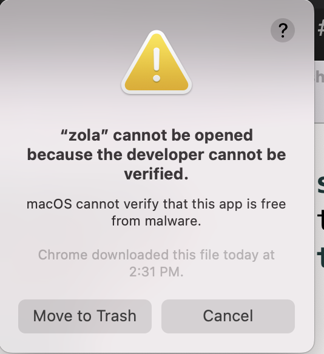
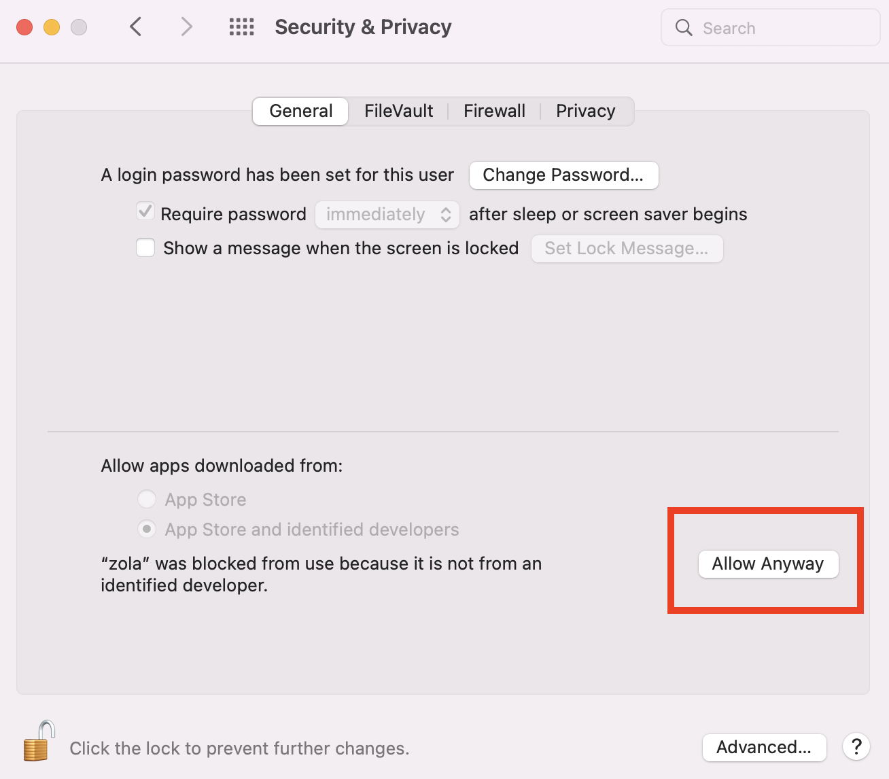

# CISC288-FinalWebsite

## Building your Website

Your website is built using [zola](https://www.getzola.org/documentation/getting-started/overview/).  If you make a modification to your website (add a new page, change text, etc.) you will need to rebuild by following these simple steps

1. Rebuild your website by simply double clicking the `build_mac.sh` file if you are using MacOS. If you are using Windows please double click the `build_windows.cmd` file.
2. Your **full** website is now in the folder called `public`.
3. Now just upload this folder to your website. Please discuss with Professor Jeremy Castagno (email: jcastagno@springfieldcollege.edu) on how to do that.

## FAQ

**Q: I am getting an error about an unidentified developer on MacOS (Apple)**

**A: Zola is a binary that needs to be "allowed" to run on an Apple computer. Here are some instruction from Apple concerning this: [Link](https://support.apple.com/guide/mac-help/open-a-mac-app-from-an-unidentified-developer-mh40616/mac)**

